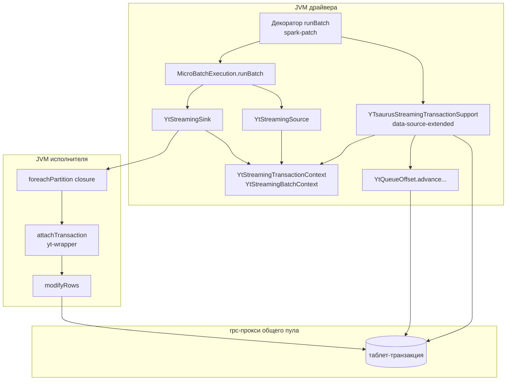
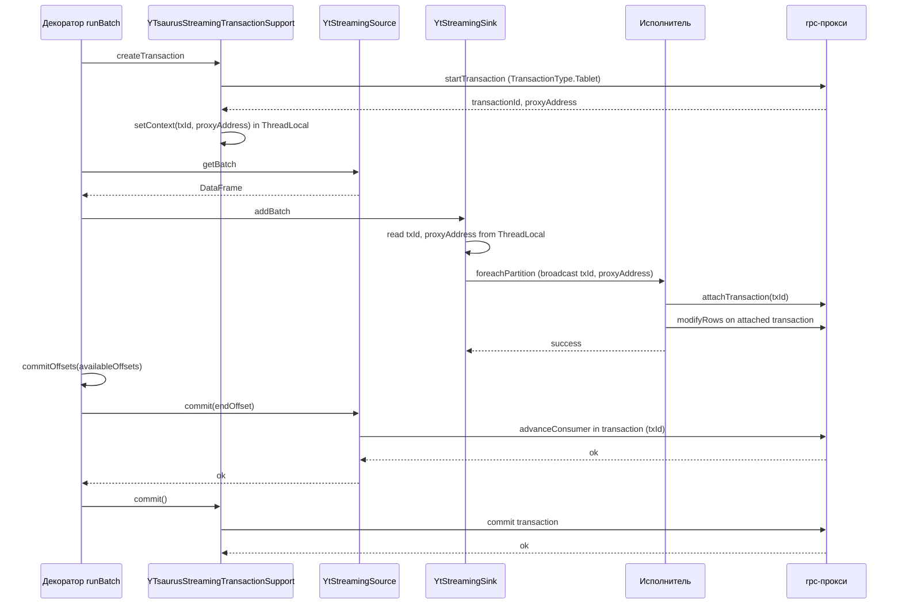

# 3 ПРОЕКТИРОВАНИЕ МОДУЛЯ ИНТЕГРАЦИИ

В настоящей главе формулируются требования к модулю распределённой транзакции, описываются используемые точки расширения Apache Spark и SPYT, анализируется соответствие партиций потокового источника и приёмника, рассматриваются два архитектурных решения и обосновывается выбор одного из них.

## 3.1 Требования к модулю

### 3.1.1 Функциональные требования

К модулю предъявляются следующие функциональные требования.

1. Гарантия строго однократной обработки потоковых данных при записи из очереди YTsaurus в динамическую таблицу YTsaurus через Spark Structured Streaming.
2. Атомарность пары «запись батча в выходную таблицу — продвижение смещения потребителя на конец батча» в рамках единой таблет-транзакции YTsaurus.
3. Корректное поведение при сбоях: либо обе операции зафиксированы, либо обе откачены, и переисполнение батча не приводит к появлению дубликатов и потере данных.
4. Прозрачность для пользовательского кода: переключение между семантиками at-least-once и exactly-once выполняется конфигурационным параметром `spark.yt.streaming.transactional`, без модификации описания потокового запроса.

### 3.1.2 Нефункциональные требования

1. Совместимость с Apache Spark 3.5.x как с приоритетной поддерживаемой версией адаптера SPYT, при сохранении совместимости с Apache Spark 3.2.x.
2. Минимизация накладных расходов на батч в установившемся режиме работы.
3. Использование существующих в SPYT механизмов расширения Apache Spark — адаптеров и инструментации байт-кода через Java-агент.
4. Совместимость с существующими реализациями `YtStreamingSource` и `YtStreamingSink`: отсутствие необходимости перепроектирования базовых компонентов.

## 3.2 Точки расширения Apache Spark и SPYT

### 3.2.1 ServiceLoader и SPI

Часть точек расширения, доступных в API модуля интеграции, реализуется средствами стандартного механизма Java ServiceLoader. Реализация интерфейса регистрируется в файле `META-INF/services/`, и Spark или SPYT загружает её в момент инициализации. В реализации одного из решений, рассматриваемых в §3.4, используется интерфейс `StreamingTransactionSupport`, объявляющий контракт жизненного цикла распределённой транзакции, и его конкретная реализация `YTsaurusStreamingTransactionSupport`, регистрируемая через ServiceLoader.

### 3.2.2 Декорирование внутренних методов Spark

Часть необходимой функциональности располагается во внутренних классах Spark, не предусматривающих штатного расширения. Для воздействия на эти классы в SPYT применяется механизм инструментации байт-кода, реализованный в модуле `spark-patch`. Главный компонент модуля — Java-агент [`SparkPatchAgent`](spark-patch/src/main/java/tech/ytsaurus/spyt/patch/SparkPatchAgent.java:49), регистрируемый через параметр `-javaagent` JVM драйвера и исполнителей. Агент сканирует classpath в поиске классов-декораторов, помеченных аннотациями [`@PatchSource`](spark-patch/src/main/java/tech/ytsaurus/spyt/patch/annotations/PatchSource.java:3) и [`@Decorate`](spark-patch/src/main/java/tech/ytsaurus/spyt/patch/annotations/Decorate.java:8), и подменяет реализации соответствующих методов в исходных классах Spark, сохраняя оригинальное поведение и оборачивая его в пользовательский код.

В реализации одного из решений, рассматриваемых в §3.4, через данный механизм декорируется метод `runBatch` класса `MicroBatchExecution` с целью внедрения логики управления контекстом батча между вызовами `Source.getBatch`, `Sink.addBatch` и `Source.commit`.

### 3.2.3 ThreadLocal-контекст

Третья точка взаимодействия — `ThreadLocal`-переменные, используемые для передачи данных между методами одного потока без изменения сигнатур. В реализации одного из решений, рассматриваемых в §3.4, используется контекст `YtStreamingTransactionContext`, хранящий идентификатор родительской транзакции и адрес rpc-прокси, на которой была создана транзакция. Использование `ThreadLocal` оправдано тем, что обработка одного батча выполняется на драйвере в одном потоке, и контракт `MicroBatchExecution` гарантирует последовательное исполнение.

## 3.3 Соответствие партиций источника и приёмника

### 3.3.1 Соответствие 1:1 на уровне источника

В реализации источника соответствие между партициями RDD и таблетами очереди установлено явно. В классе [`YtQueueRange`](data-source-extended/src/main/scala/tech/ytsaurus/spyt/streaming/YtQueueRange.scala:6) индекс Spark-партиции переопределён равным индексу таблета:

```scala
case class YtQueueRange(tabletIndex: Int, lowerIndex: Long, upperIndex: Long) extends Partition {
  override def index: Int = tabletIndex
}
```

В методе [`YtQueueRDD.getPartitions`](data-source-extended/src/main/scala/tech/ytsaurus/spyt/streaming/YtQueueRDD.scala:48) партиции возвращаются отсортированными по `tabletIndex`, что обеспечивает стабильный порядок и взаимно однозначное соответствие между партициями RDD и таблетами очереди.

Свойство 1:1 соответствия позволяет в принципе организовать на каждом исполнителе независимую таблет-транзакцию, обрабатывающую один таблет: запись в выходную таблицу строк одного таблета и продвижение смещения потребителя для этого же таблета.

### 3.3.2 Потеря соответствия после преобразований

Однако данное свойство справедливо лишь до тех пор, пока RDD источника проходит через узкие преобразования (`map`, `filter`, `mapPartitions`), сохраняющие партиционирование. Любое широкое преобразование пользовательского пайплайна — `groupBy`, `join`, `repartition`, оконная агрегация — выполняет shuffle и пересоздаёт партиционирование результата. После shuffle партиция приёмника содержит строки, происходящие из произвольного подмножества таблетов источника, и независимое продвижение смещения по таблету становится невозможным: исполнитель не знает, какие таблеты внесли вклад в его партицию и в каком объёме.

Между источником и приёмником ничто не гарантирует отсутствие широких преобразований, поэтому решение, рассчитанное на сохранение партиционирования, нельзя считать применимым в общем случае.

### 3.3.3 Следствия для архитектуры

Из анализа следует, что распределённая координация транзакции должна допускать одно из двух:

- сведение всего батча к одному исполнителю, способному провести транзакцию целиком;
- предоставление множеству исполнителей возможности участвовать в одной общей транзакции, координируемой драйвером.

Эти два способа порождают два архитектурных варианта, рассмотренных далее.

## 3.4 Архитектурные решения

В §3.3.3 показано, что распределённая координация транзакции допускает либо сведение всего батча к одному исполнителю, либо вовлечение множества исполнителей в одну общую транзакцию, координируемую драйвером. Этим двум стратегиям соответствуют два архитектурных решения, рассмотренных ниже.

### 3.4.1 Решение 1: запись на одном исполнителе

Идея решения состоит в том, чтобы перед записью применять к датафрейму операцию `coalesce(1)`. После её применения весь батч обрабатывается одним заданием Spark на одном исполнителе. Этот исполнитель самостоятельно открывает таблет-транзакцию через локальный rpc-прокси, встроенный в его job-proxy, выполняет в этой транзакции запись данных батча и операцию `advanceConsumer` для всех таблетов очереди, после чего фиксирует транзакцию. На драйвере метод `Source.commit` при включённом флаге `spark.yt.streaming.transactional` пропускает действия по продвижению смещения, поскольку оно уже выполнено в составе фиксированной транзакции.

Жизненный цикл батча в решении 1 выглядит следующим образом.

1. На драйвере метод `Source.getBatch` формирует RDD из таблетов очереди.
2. На драйвере метод `Sink.addBatch` применяет к датафрейму `coalesce(1)` и запускает задание `foreachPartition` с одной партицией.
3. На выбранном исполнителе открывается таблет-транзакция через локальный rpc-прокси.
4. В этой транзакции выполняется построчная запись данных батча через `modifyRows`.
5. В этой же транзакции для каждого таблета очереди, попавшего в батч, выполняется операция `advanceConsumer` с соответствующим конечным смещением.
6. Транзакция фиксируется методом `commit`. При сбое на любом из шагов 4–6 транзакция отменяется методом `abort`, и Spark переисполняет батч.
7. На драйвере метод `Source.commit` пропускает действия по продвижению смещения.

С точки зрения реализации решение 1 локально для модуля `data-source-extended`: достаточно ввести альтернативную ветку в методе `YtStreamingSink.addBatch`, отрабатывающую при включённом флаге `spark.yt.streaming.transactional`, и зеркальную ветку в `YtStreamingSource.commit`, отключающую штатное продвижение смещения. Транзакция рождается, живёт и умирает внутри замыкания, переданного в `foreachPartition`, и не пересекает границу JVM. По этой причине решение 1 не требует ни инструментации байт-кода `MicroBatchExecution`, ни введения интерфейса `StreamingTransactionSupport`, ни `ThreadLocal`-контекстов передачи идентификатора транзакции между фазами обработки батча.

Сильная сторона решения — простота реализации, локализация изменений в одном модуле SPYT и отсутствие изменений в сторонних проектах. Решение опирается на штатный механизм таблет-транзакций, описанный в главе 2, и не требует расширения клиентской библиотеки YT.

Слабая сторона решения — потеря параллелизма записи. Операция `coalesce(1)` сводит все партиции к одной без shuffle, и после её применения исходный план превращается в одну стадию из одного таска: пользовательские преобразования, чтение из таблетов очереди, формирование выходных строк, сериализация в формат `modifyRows` и сетевая передача в rpc-прокси выполняются в одном потоке одного процесса. На пути к динамической таблице возникают два узких места: пропускная способность одного исполнителя и пропускная способность одного rpc-прокси. Совместный потолок определяется минимумом двух, и обычно лимитирует именно исполнитель: данные не успевают сформироваться в темпе, при котором прокси становится узким местом. Дополнительно, накопление всего батча в памяти одного процесса повышает риск его исчерпания на больших батчах.

### 3.4.2 Решение 2: общий пул rpc-прокси и AttachTransaction

Идея решения состоит в том, чтобы изменить конфигурацию SPYT на общий пул rpc-прокси (флагом `spark.ytsaurus.rpc.job.proxy.enabled=false`) и расширить клиентскую библиотеку YT операцией присоединения исполнителя к существующей таблет-транзакции, открытой драйвером. На стороне библиотеки реализуется функция `attachTransaction(transactionId, proxyAddress)`, создающая локальный объект `ApiServiceTransaction`, который направляет запросы в указанный rpc-прокси с указанным идентификатором. Поскольку все исполнители работают с тем же rpc-прокси, что и драйвер, состояние таблет-транзакции остаётся видимым каждому из них (см. §2.4).

Жизненный цикл батча в решении 2 выглядит следующим образом (визуализация на уровне последовательности вызовов между драйвером, исполнителями и rpc-прокси приведена в §3.5.4).

1. На драйвере метод `Source.getBatch` формирует RDD из таблетов очереди.
2. На драйвере непосредственно перед `Sink.addBatch` открывается таблет-транзакция; её идентификатор и адрес rpc-прокси, на которой она открыта, сохраняются в `YtStreamingTransactionContext`.
3. Spark материализует RDD согласно пользовательскому плану и запускает `foreachPartition` со штатным числом партиций.
4. На каждом исполнителе через `attachTransaction` создаётся локальный объект транзакции, в котором выполняется запись данных партиции операцией `modifyRows`.
5. После завершения всех заданий записи драйвер выполняет `advanceConsumer` для каждого таблета очереди в той же транзакции.
6. Драйвер фиксирует транзакцию методом `commit`. При сбое любой задачи записи или последующих операций драйвер вызывает `abort`, и Spark переисполняет батч.
7. На драйвере метод `Source.commit` пропускает действия по продвижению смещения.

С точки зрения реализации решение 2 требует трёх компонентов, рассмотренных в §3.2: интерфейса `StreamingTransactionSupport`, регистрируемого через ServiceLoader, инструментации метода `MicroBatchExecution.runBatch` через Java-агент и пары `ThreadLocal`-контекстов для передачи идентификатора транзакции и параметров батча между методами драйвера. Дополнительно требуется расширение клиентской библиотеки YT функцией `attachTransaction`, что затрагивает соседний проект.

Преимуществом данного решения является сохранение параллелизма записи. Каждый исполнитель обрабатывает свою партицию на своих ядрах, в своей JVM, и сериализация выходных строк, формирование запросов `modifyRows` и заполнение сетевого канала к rpc-прокси выполняются параллельно на всех исполнителях. На пути к динамической таблице остаётся одно узкое место — общая rpc-прокси, через которую проходят все запросы транзакции, — но оно является серверным компонентом и при равных ресурсах кратно превосходит пропускную способность одного исполнителя. Дополнительно, объём записи в рамках одной транзакции регулируется параметром `spark.yt.write.dynBatchSize`, который определяет количество строк, накапливаемых перед отправкой запроса `modifyRows`. Это позволяет балансировать между количеством запросов к rpc-прокси и размером каждого запроса, адаптируясь под характеристики сети и производительность прокси.

Слабая сторона решения — повышенная сложность реализации и эксплуатации. Использование инструментации байт-кода Spark делает код чувствительным к смене минорных версий Spark и усложняет отладку: сбой в декорированном методе наблюдается как ошибка во внутреннем коде Spark, не имеющая прямого соответствия в исходных текстах SPYT. Расширение клиентской библиотеки YT функцией `attachTransaction` распространяет область изменений за пределы SPYT.

### 3.4.3 Сравнение решений

В таблице 3.1 приводится сравнение существующего частичного решения (§1.5), решения 1 и решения 2 по характеристикам, существенным для постановки задачи (§1.6).

**Таблица 3.1 — Сравнение существующего и предлагаемых решений**

| Характеристика                                                  | Существующее решение (§1.5) | Решение 1                           | Решение 2                                                |
| --------------------------------------------------------------- | --------------------------- | ----------------------------------- | -------------------------------------------------------- |
| Целевой тип таблицы                                             | сортированная динамическая  | упорядоченная динамическая          | упорядоченная динамическая                               |
| Семантика при произвольных преобразованиях                      | at-least-once               | exactly-once                        | exactly-once                                             |
| Семантика при stateless-преобразованиях с малым объёмом таблицы | exactly-once                | exactly-once                        | exactly-once                                             |
| Параллелизм записи                                              | сохраняется                 | теряется                            | сохраняется                                              |
| Узкие места записи                                              | первичный ключ              | один исполнитель и общая rpc-прокси | общая rpc-прокси                                         |
| Зависимость пропускной способности от объёма таблицы            | деградация по мере роста    | отсутствует                         | отсутствует                                              |
| Зависимость пропускной способности от размера батча             | линейная                    | OOM-риск на больших батчах          | линейная                                                 |
| Изменения в SPYT                                                | нет                         | локальные в `data-source-extended`  | в `data-source-extended`, `spark-patch`, `spark-adapter` |
| Изменения в сторонних проектах                                  | нет                         | нет                                 | расширение клиентской библиотеки YT                      |
| Использование инструментации байт-кода Spark                    | нет                         | нет                                 | да                                                       |

### 3.4.4 Обоснование выбора решения 2

Из таблицы 3.1 следует, что по постановке задачи (§1.6) ни существующее решение, ни решение 1 не удовлетворяют всем требованиям одновременно.

Существующее решение исключается двумя свойствами, явно противоречащими §1.6: оно ограничивает область применимости преобразованиями, не нарушающими однозначное соответствие между входной и выходной строкой, и его пропускная способность деградирует с ростом объёма целевой таблицы.

Решение 1 удовлетворяет требованиям корректности и применимости, но не удовлетворяет требованию по пропускной способности. По всем характеристикам производительности оно строго уступает решению 2: к ограничению со стороны общей rpc-прокси, наследуемому обоими решениями, добавляется ограничение со стороны одного исполнителя, через который сериализуется запись всего батча. Преимущество решения 1 — простота реализации — окупается однократно, тогда как ограничение пропускной способности проявляется на каждом батче эксплуатации.

Решение 2 удовлетворяет всем требованиям §1.6: обеспечивает exactly-once при произвольных преобразованиях, не привязано к специфическому типу таблицы и сохраняет параллелизм записи, не уступая существующему решению по пропускной способности на задачах, где последнее применимо. Стоимость реализации, выраженная в инструментации байт-кода Spark и расширении клиентской библиотеки YT, является разовой и не влияет на эксплуатационные характеристики.

На основании изложенного к реализации принимается решение 2. Решение 1 в дальнейших главах работы не рассматривается, кроме контекстов, где оно явно полезно как точка сравнения.

## 3.5 Архитектура выбранного решения

В настоящем разделе фиксируется состав компонентов решения 2, распределение ответственности между ними, перечень изменений в существующих частях SPYT и поток управления при обработке одного микропакета. Формальное описание протокола атомарной фиксации, включая разбор поведения при сбоях, вынесено в §3.6.

### 3.5.1 Состав модулей и распределение ответственности

Реализация решения 2 затрагивает четыре модуля Gradle-проекта SPYT и одну точку расширения клиентской библиотеки YT. Распределение ответственности между ними соответствует разделению функциональности на устойчивые и изменяемые относительно версии Spark компоненты.

Модуль `data-source-extended` содержит существующие классы потокового источника `YtStreamingSource`, потокового приёмника `YtStreamingSink` и поддерживающие их `YtQueueOffset`, `YtQueueRange`, `YtQueueRDD`. В рамках решения 2 в этот модуль вносится альтернативная ветка обработки батча, активируемая флагом `spark.yt.streaming.transactional`, и реализация SPI `YTsaurusStreamingTransactionSupport`, инкапсулирующая жизненный цикл таблет-транзакции на драйвере.

Модуль `spark-adapter` содержит интерфейс `StreamingTransactionSupport` и пару `ThreadLocal`-контекстов, передающих идентификатор транзакции и параметры батча между фазами обработки на драйвере. Размещение интерфейса в `spark-adapter`, а не в `data-source-extended`, продиктовано необходимостью обращаться к нему из декоратора `MicroBatchExecution`, расположенного в `spark-patch`.

Модуль `spark-patch` содержит декоратор метода `MicroBatchExecution.runBatch`, помеченный аннотациями `@PatchSource` и `@Decorate` (см. §3.2.2). Декоратор оборачивает оригинальный метод вызовами начальной и завершающей фаз, делегируемыми реализации SPI, загруженной через ServiceLoader.

Модуль `yt-wrapper` содержит вспомогательные утилиты для работы с таблет-транзакциями YTsaurus. В нём вводится утилита, оборачивающая операцию `attachTransaction`, расширяющая клиентскую библиотеку YT.

Точкой расширения клиентской библиотеки YT является функция `attachTransaction(transactionId, proxyAddress)`, создающая локальный объект `ApiServiceTransaction`, направляющий запросы в указанный rpc-прокси с указанным идентификатором (см. §2.4.2, второй путь устранения изоляции).

### 3.5.2 Компонентная диаграмма

На рисунке 3.1 показан состав компонентов решения 2 и связи между ними. Прямоугольниками со скруглёнными углами обозначены процессы JVM (драйвер, исполнитель, rpc-прокси), сплошными прямоугольниками — модули и классы внутри процессов, стрелками — направление вызовов.



**Рисунок 3.1 — Компонентная диаграмма решения 2**

Драйвер сосредотачивает управление жизненным циклом транзакции в реализации SPI `YTsaurusStreamingTransactionSupport`, вызываемой из декоратора `runBatch`. Передача идентификатора транзакции и параметров батча между методами драйвера происходит через `ThreadLocal`-контексты. Исполнители не открывают и не фиксируют транзакцию: они лишь присоединяются к ней через `attachTransaction` и направляют запросы `modifyRows` в тот же rpc-прокси, на котором она открыта.

### 3.5.3 Изменения в существующих компонентах SPYT

Перечень компонентов, затрагиваемых реализацией решения 2, и характер изменений приведён ниже.

1. [`YtStreamingSource`](data-source-extended/src/main/scala/tech/ytsaurus/spyt/streaming/YtStreamingSource.scala) — метод `getBatch` не изменяется; в методе `commit` при наличии активного контекста транзакции смещение потребителя продвигается в составе этой транзакции через `offsetProvider.advance(..., parentTransactionId)`; при отсутствии контекста и включённом флаге `spark.yt.streaming.transactional` метод завершается без действий (транзакция ещё не зафиксирована декоратором).
2. [`YtStreamingSink`](data-source-extended/src/main/scala/tech/ytsaurus/spyt/streaming/YtStreamingSink.scala) — в методе `addBatch` идентификатор открытой драйвером транзакции и адрес rpc-прокси извлекаются из `YtStreamingTransactionContext` и доставляются на исполнители широковещательными переменными; в замыкании `foreachPartition` создаётся локальный объект транзакции через `attachTransaction`, и запись `modifyRows` выполняется в этой транзакции вместо открытия собственной.
3. [`YtDynamicTableWriter`](data-source/src/main/scala/tech/ytsaurus/spyt/format/YtDynamicTableWriter.scala) — расширяется необязательным параметром `parentTransaction: Option[ApiServiceTransaction]`; при его наличии запросы `modifyRows` направляются в переданную транзакцию, а не открывают собственную.
4. `MicroBatchExecution.runBatch` (Apache Spark) — декорируется через механизм `spark-patch`. Декоратор перед вызовом оригинального метода открывает таблет-транзакцию и помещает её идентификатор и адрес прокси в `YtStreamingTransactionContext`; после возврата из оригинального метода вызывает `commitOffsets`, который через `Source.commit` продвигает смещение потребителя в составе той же транзакции, после чего фиксирует транзакцию; при исключении — отменяет транзакцию и откатывает запись в commit-лог Spark. Оригинальное поведение `runBatch` сохраняется без изменений.
5. Новый класс `YTsaurusStreamingTransactionSupport` (модуль `data-source-extended`) — реализация SPI `StreamingTransactionSupport`, регистрируемая в `META-INF/services/`. Инкапсулирует создание таблет-транзакции (`TransactionType.Tablet`, `sticky=true`), получение адреса rpc-прокси через рефлексию, а также операции `commit` и `abort`.
6. Новый интерфейс `StreamingTransactionSupport` (модуль `spark-adapter`) — контракт жизненного цикла распределённой транзакции с методами `isTransactionalStreamingEnabled`, `createTransaction`, `setTransaction`, `clearTransactionId`, `isRecoveryNeeded`, `markRecoveryNeeded`, `clearRecoveryNeeded`.
7. Новый `ThreadLocal`-контекст `YtStreamingTransactionContext` (модуль `data-source-extended`) — хранит `StreamingTxContext(txId, stickyAddress)` и флаг `recoveryNeededFlag`.
8. Расширение `yt-wrapper` функцией `attachTransaction(transactionId)` — оборачивает операцию `AttachTransaction` клиентской библиотеки YT.

### 3.5.4 Поток управления при обработке батча

На рисунке 3.2 показан поток управления при штатной обработке одного микропакета в решении 2. Указаны только сообщения, относящиеся к управлению транзакцией; пользовательская логика и стандартные сообщения Spark опущены.



**Рисунок 3.2 — Поток управления при штатной обработке батча в решении 2**

Декоратор `runBatch` получает управление перед оригинальным методом и вызывает `createTransaction` SPI, которая открывает таблет-транзакцию (`TransactionType.Tablet`) через rpc-прокси общего пула и сохраняет её идентификатор и адрес прокси в `YtStreamingTransactionContext`. Оригинальный `runBatch` исполняется без изменений: вызывается `Source.getBatch`, формируется план, исполняется `Sink.addBatch`. На стороне приёмника идентификатор транзакции и адрес rpc-прокси извлекаются из `YtStreamingTransactionContext` и доставляются на исполнители широковещательными переменными; в замыкании `foreachPartition` создаётся локальный объект транзакции через `attachTransaction`, и запись `modifyRows` выполняется в нём. После возврата из оригинального `runBatch` декоратор вызывает `commitOffsets`, который обходит все источники и вызывает `Source.commit(endOffset)`. В методе `YtStreamingSource.commit` при наличии активного контекста транзакции смещение потребителя продвигается в составе той же транзакции через `advanceConsumer`. Затем декоратор фиксирует транзакцию вызовом `commit()` на объекте `StreamingTransactionHandle`.

## 3.6 Протокол атомарной фиксации батча

В настоящем разделе формализован протокол атомарной фиксации батча в решении 2. Протокол описывает последовательность шагов, инварианты после каждого шага и поведение при сбоях.

### 3.6.1 Последовательность шагов

Протокол состоит из шести шагов, выполняемых в рамках одного батча. На первом шаге драйвер создаёт таблет-транзакцию на rpc-прокси с параметром `sticky=true`. Транзакция получает уникальный идентификатор `txId`, а адрес прокси сохраняется как `stickyAddress`. Контекст, состоящий из пары `(txId, stickyAddress)`, устанавливается в `YtStreamingTransactionContext`. После этого транзакция открыта и активна на одном rpc-прокси, а контекст доступен в текущем потоке драйвера.

На втором шаге Spark вызывает метод `Source.getBatch`, который формирует RDD из таблетов очереди. Чтение данных выполняется без транзакции, поскольку чтение не требует атомарности. К этому моменту данные батча загружены в RDD, а транзакция остаётся активной.

Третий шаг заключается в широковещании контекста. Драйвер упаковывает `txId` и `stickyAddress` в широковещательные переменные и передаёт их на исполнители. После этого контекст транзакции доступен на всех исполнителях, а транзакция продолжает быть активной.

На четвёртом шаге происходит запись данных на исполнителях. Каждый исполнитель создаёт клиента, зафиксированного на `stickyAddress`, и присоединяется к транзакции через вызов `attachTransaction(txId)`. В рамках присоединённой транзакции выполняются запросы `modifyRows` для вставки строк в выходную таблицу. После завершения этого шага все строки батча записаны в транзакцию, но транзакция ещё не закоммичена, поэтому записи невидимы другим транзакциям.

Пятый шаг — продвижение смещения потребителя. Драйвер вызывает метод `Source.commit`, внутри которого `YtStreamingSource.commit` выполняет операцию `advanceConsumer` в составе той же транзакции, используя `txId` из контекста. В результате смещение потребителя продвинуто в транзакции, а запись данных и продвижение смещения находятся в одной транзакции.

На шестом шаге драйвер вызывает метод `commit()` на транзакции. После успешной фиксации данные становятся видимыми, а смещение потребителя сохраняется. Батч зафиксирован атомарно, данные записаны и видны, а смещение потребителя продвинуто.

### 3.6.2 Поведение при сбоях

При сбое на первом шаге, то есть при открытии транзакции, исключение передаётся в декоратор, который не устанавливает контекст и делегирует обработку штатному механизму Spark. Батч переисполняется. В этом случае транзакция не создана, смещение не продвинуто, а данные не записаны.

Если сбой происходит на четвёртом шаге при записи на исполнителе, исключение из `foreachPartition` передаётся в драйвер. Декоратор отменяет транзакцию через вызов `abort()`, устанавливает флаг `recoveryNeeded` и откатывает запись в commit-лог Spark через `commitLog.purgeAfter(batchId - 1)`. Транзакция отменена, поэтому записи в таблице невидимы. Commit-лог откатлен, поэтому Spark переисполнит батч с теми же смещениями.

При сбое на пятом шаге, то есть при выполнении `advanceConsumer`, исключение из `Source.commit` перехватывается декоратором, который отменяет транзакцию и откатывает commit-лог. Транзакция отменена, поэтому записи в таблице невидимы, смещение не продвинуто, а Spark переисполнит батч.

Если сбой происходит на шестом шаге при фиксации транзакции, исключение из `commit()` перехватывается декоратором, который устанавливает флаг `recoveryNeeded`. Транзакция может находиться в неопределённом состоянии, но YTsaurus гарантирует её завершение — либо commit, либо abort. При повторном батче декоратор проверит флаг и синхронизирует состояние. Если транзакция закоммичена, то данные видны и смещение продвинуто. Если транзакция отменена, то данные невидимы и смещение не продвинуто. В обоих случаях консистентность сохраняется.

При потере связи с rpc-прокси исполнитель наблюдает сетевую ошибку при выполнении `modifyRows`. Исключение передаётся в драйвер, который отменяет транзакцию. При переисполнении батча новая транзакция открывается на доступном прокси. Отменённая транзакция не оставляет видимых записей, а переисполнение батча читает те же данные.

### 3.6.3 Взаимодействие с commit-логом Spark

Spark Structured Streaming сохраняет смещения в commit-лог после успешного выполнения батча. В транзакционном режиме декоратор контролирует эту логику. При штатном завершении декоратор вызывает `commitOffsets()`, который обновляет commit-лог, после чего фиксирует транзакцию. Смещение в commit-логе соответствует продвинутому смещению потребителя в YTsaurus.

Если сбой происходит после записи в commit-лог, декоратор проверяет флаг `commitLogWritten` и при необходимости откатывает запись через `commitLog.purgeAfter(batchId - 1)`, заставляя Spark переисполнить батч. При сбое до записи в commit-лог сам commit-лог не изменяется, и Spark переисполняет батч с теми же смещениями.

При восстановлении после сбоя, например при рестарте драйвера, Spark читает смещения из commit-лога, но `YtStreamingSource.getBatch` приоритизирует состояние потребителя YTsaurus как источник истины. Если потребитель не был продвинут, то есть транзакция не была закоммичена, батч переисполняется с корректными смещениями.

\newpage

## 3.7 Риски и компромиссы

В настоящем разделе перечислены риски, существенные для эксплуатации решения 2, и принятые архитектурные компромиссы. Под риском понимается событие или свойство среды, способное привести к деградации функциональных или нефункциональных требований §3.1; под компромиссом — осознанное архитектурное решение, ограничивающее одно из требований в обмен на удовлетворение другого.

### 3.7.1 Зависимость от внутреннего API Apache Spark

Декорирование метода `MicroBatchExecution.runBatch` через инструментацию байт-кода (§3.2.2) опирается на внутреннее, не специфицированное публично API Apache Spark. Изменение сигнатуры метода, его разбиение на несколько методов или существенное изменение последовательности вызовов внутри него в новых минорных версиях Spark способно сломать декоратор: либо в момент загрузки агента (несовпадение сигнатуры), либо в момент исполнения (несовпадение предположений о порядке вызовов `Source.getBatch` и `Sink.addBatch`).

Принятые меры смягчения. Декорируемые классы Apache Spark вынесены в модуль `spark-adapter`, имеющий по реализации на каждую поддерживаемую версию Spark, и подгружаются Java-агентом по результатам определения версии в момент инициализации (§3.2.2). Конкретный декоратор `runBatch` для решения 2 размещается в существующей инфраструктуре адаптеров и опирается на стабильные точки взаимодействия с `Source` и `Sink`, наблюдаемые во всех версиях Spark, поддерживаемых SPYT (3.2.x–3.5.x). Расширение поддерживаемого диапазона версий Spark в SPYT выполняется централизованно через `spark-adapter` и не требует отдельной работы по сопровождению декоратора решения 2.

### 3.7.2 Общая rpc-прокси как точка отказа

Конфигурация с общим пулом rpc-прокси (`spark.ytsaurus.rpc.job.proxy.enabled=false`) переносит точку отказа из job-proxy исполнителей в общий пул. Все запросы транзакции — `createTransaction`, `pingTransaction`, `modifyRows` с каждого исполнителя, `advanceConsumer`, `commit` — обслуживаются одним rpc-прокси, на котором открыта транзакция, и отказ этого прокси в течение жизни транзакции приводит к её аварийному завершению независимо от состояния запросов записи на исполнителях. Тем не менее аварийное завершение транзакции не нарушает корректности: незафиксированная транзакция не оставляет следа ни в выходной таблице, ни в состоянии потребителя, и Spark переисполняет батч штатным образом. Кроме того, общий пул rpc-прокси YTsaurus состоит из множества равноправных экземпляров с собственным резервированием на уровне инфраструктуры YTsaurus, и среднее время между отказами одного прокси из пула существенно превосходит соответствующую величину для одиночного процесса исполнителя. На уровне SPYT дополнительной логики восстановления соединения не вводится; повторное открытие транзакции выполняется на следующем батче после переисполнения текущего, что согласуется с принятой моделью отказоустойчивости Spark Structured Streaming.

### 3.7.3 Соотношение времени жизни таблет-транзакции и длительности батча

Таблет-транзакция YTsaurus имеет ограниченное время жизни, продлеваемое периодическими сообщениями `pingTransaction` (§2.3.3). Если обработка батча превышает таймаут транзакции и пинги не отправляются вовремя, прокси отменяет транзакцию автоматически, что наблюдается на драйвере как ошибка «No such transaction» при попытке `commit`.

Источниками превышения являются: длительные пользовательские преобразования внутри `runBatch`, медленная сериализация выходных строк, замедленная сеть до прокси, длинные паузы сборки мусора на драйвере. Дополнительный риск — несоответствие между временем жизни транзакции, заданным при её открытии, и реальной длительностью батча на загруженных кластерах.

Принятые меры смягчения. Во-первых, пинг транзакции запускается в отдельном фоновом потоке драйвера сразу после открытия транзакции и останавливается при `commit`, `abort` или исключении в декораторе. Период пинга задаётся в долях от заявленного времени жизни транзакции. Во-вторых, время жизни транзакции конфигурируется параметром, доступным пользователю SPYT, и устанавливается с запасом относительно ожидаемой 99-й перцентили длительности батча. В-третьих, при наблюдении регулярных таймаутов в эксплуатации увеличение времени жизни транзакции является штатной реакцией, не требующей изменения кода.

### 3.7.4 Разрыв соединения исполнителя с rpc-прокси

Между моментами `attachTransaction` и завершением последнего `modifyRows` исполнитель удерживает соединение с rpc-прокси, на котором открыта транзакция. Разрыв этого соединения наблюдается на исполнителе как сетевая ошибка при очередном `modifyRows` либо как ошибка ответа от прокси.

Принятые меры смягчения. Во-первых, исполнитель не пытается восстановить соединение или повторно присоединиться к транзакции: исключение, выброшенное из замыкания `foreachPartition`, передаётся в драйвер штатным механизмом Spark и обрабатывается как сбой задачи записи. Во-вторых, драйвер при первом сбое любой задачи записи отменяет транзакцию через `abort` и не пытается фиксировать частично завершённую запись. В-третьих, переисполнение батча выполняется штатным механизмом Spark Structured Streaming с тем же набором смещений источника, поскольку `Source.commit` не успел выполнить продвижение смещения. Корректность сохраняется в силу того, что отменённая таблет-транзакция не оставляет видимых строк в выходной таблице (§2.2.1).

### 3.7.5 Сводка компромиссов

Совокупность принятых при проектировании решений приводит к набору компромиссов, каждый из которых обменивает одно желательное свойство системы на другое и разрешается за счёт инфраструктурных или эксплуатационных мер.

- В обмен на сохранение параллелизма записи допускается зависимость от внутреннего API Apache Spark, разрешаемая инфраструктурой версионных адаптеров `spark-adapter`.
- В обмен на единственность узкого места допускается централизация запросов транзакции на общем rpc-прокси, разрешаемая опорой на серверное резервирование YTsaurus.
- В обмен на простоту обработки сбоев допускается отсутствие частичного восстановления внутри батча: любой сбой приводит к отмене транзакции и переисполнению батча целиком, что согласуется с моделью Spark Structured Streaming.

\newpage
